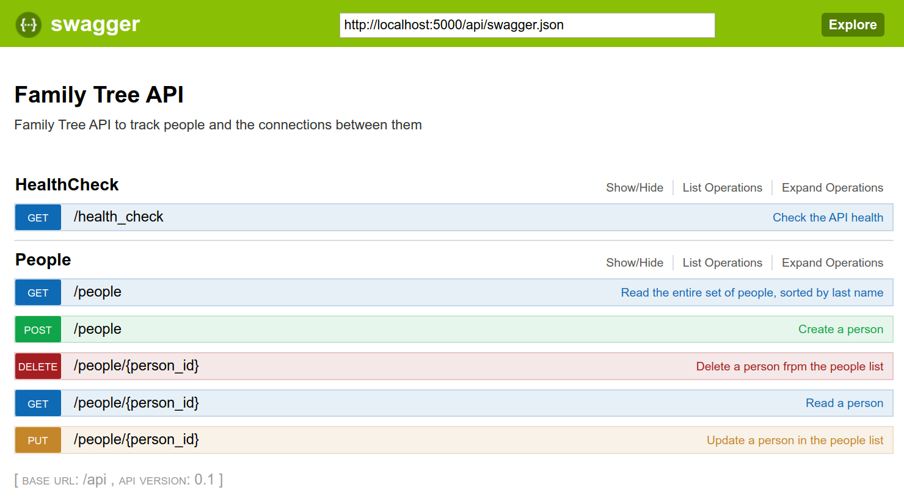

# Family Tree REST API

This coding challenge involved building a Family Tree API to handle people and their connections (parent(s), siblings, children, grandchildren and cousins).

**Note**:

While working on the Parent Child Relationship, I came across an error I was unable to resolve:

```bash
sqlalchemy.exc.InvalidRequestError: When initializing mapper mapped class, expression failed to locate a name ("name 'parentchildrelation' is not defined"). If this is a class name, consider adding this relationship() to the <class 'family_tree.data.people.Person'> class after both dependent classes have been defined.
```

Even after replicating the models from [Family Tree API Github Repo](https://github.com/alysivji/flask-family-tree-api), I was unable to get it working while verifying running that repo's application did work although it never generated a database. I will endeavour to gain a deeper understanding of SQLAlchemy's many to many relationships and resolve this blocker as I ended up spending getting that and testing to work.

## How to Run

If you have docker installed, a `Makefile` is provided to quickly build and run the Docker image defined in `Dockerfile`.

```bash
# Build
$ docker build --rm --no-cache -t family-tree-api:1.0 .

# Run
$ docker run -it --rm -p 5000:5000 family-tree-api:1.0
```

OR

```bash
$ make docker-build
...
$ make docker-run
```

## REST API

Using Connexion was very helpful as it resulted in a UI for the API:




Below is the REST API I designed and was implementing.

| ACTION | HTTP VERB | URL PATH                   | DESCRIPTION                            |
| :----: | :-------: | :------------------------- | :------------------------------------- |
| CREATE |   POST    | /person                    | Create a person                        |
|  READ  |    GET    | /person                    | Get everyone                           |
|  READ  |    GET    | /person/<id>               | Get a person                           |
| UPDATE |  UPDATE   | /person/<id>               | Update a person                        |
| DELETE |  DELETE   | /person/<id>               | Delete a person                        |
| DELETE |    GET    | /parents/<person_id>       | Get a list of a person's siblings      |
| UPDATE |    PUT    | /parent/<person_id>        | Update a person's parent               |
|  READ  |    GET    | /cousins/<person_id>       | Get a list of a person's cousins       |
| DELETE |    GET    | /grandparents/<person_id>  | Get a list of a person's grandparents  |
| DELETE |    GET    | /siblings/<person_id>      | Get a list of a person's siblings      |
| DELETE |  DELETE   | /relationships/<person_id> | Get a list of a person's relationships |


## Tools Used

- Flask
- SQLAlchemy
- Connexion
- Pytest
- Marshmallow

## Steps

- [x] Create Person Model
- [x] Create Person API
- [ ] Create Parent Child Relationship Model
- [ ] Create Person's Relationship API
- [ ] Create tests
  - [ ] Test Models
  - [ ] Test APIs
  - [x] Test Health Check
- [ ] Logging
- [ ] Database Migrations
- [ ] Contextual Validation 
  - [ ] Ensure age is appropriate for parent vs child
  - [ ] Ensure only 0 - 2 parents allowed
- [x] Dockerfile


## Resources

- [Python REST APIs with Flask, Connexion, and SQLAlchemy](https://realpython.com/flask-connexion-rest-api/)
- [Connexion Example App](https://github.com/hjacobs/connexion-example)
- [Testing a Flask Application using Pytest](https://www.patricksoftwareblog.com/testing-a-flask-application-using-pytest/)
- [Flask Documentation](https://flask.palletsprojects.com/en/1.1.x/)
- [Testing Flask Applications](https://flask.palletsprojects.com/en/1.1.x/testing/)

----

# be-coding-challenge

### Expectations
- We do not expect you to completely finish the challenge. We ask that candidates spend 4 hours or more working through the challenge. With that we understand that everyone's schedule and availability is different so we ask that you provide a reasonable estimate of your time commitment so we can take it into account when evaluating your submission.
- We expect you to leverage creative license where it makes sense. If you'd like to change the project structure, pull in libraries, or make assumptions about the requirements we openly encourage you to do so. All that we ask is that you are prepared to talk about your choices in future interviews. 

### Challenge
For this challenge you will be implementing a family tree API.

The API should be capable of keeping track of people and the connections between them.

While you have full control to model the entities as you see fit you should keep the following guidelines in mind.

Details about a person and their relationships should be editable. At a minimum you should use the following traits to describe a person: 
- First name
- Last name
- Phone number
- Email address
- Address
- Birth date

When thinking about relations between people the API should be able to provide the following information
- For a given person list all of their siblings
- For a given person list all of their parents
- For a given person list all their children
- For a given person list all of their grandparents
- For a given person list all of their cousins

### Getting started

##### Running the service in a virtual environment
If you are using python 3.7 you will need to run
```bash
pipenv run pip install pip==18.0
```

To install dependencies you will need to run
```bash
pipenv install
```

Once dependencies are installed you can run the service with
```bash
pipenv run python manage.py
```
or
```bash
pipenv shell
python server.py
```